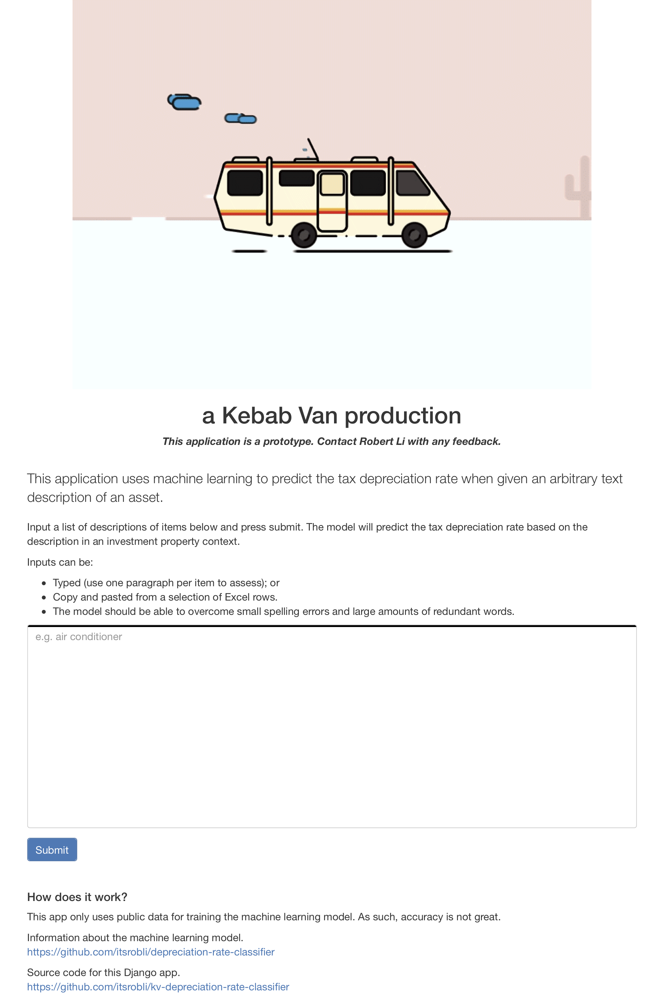
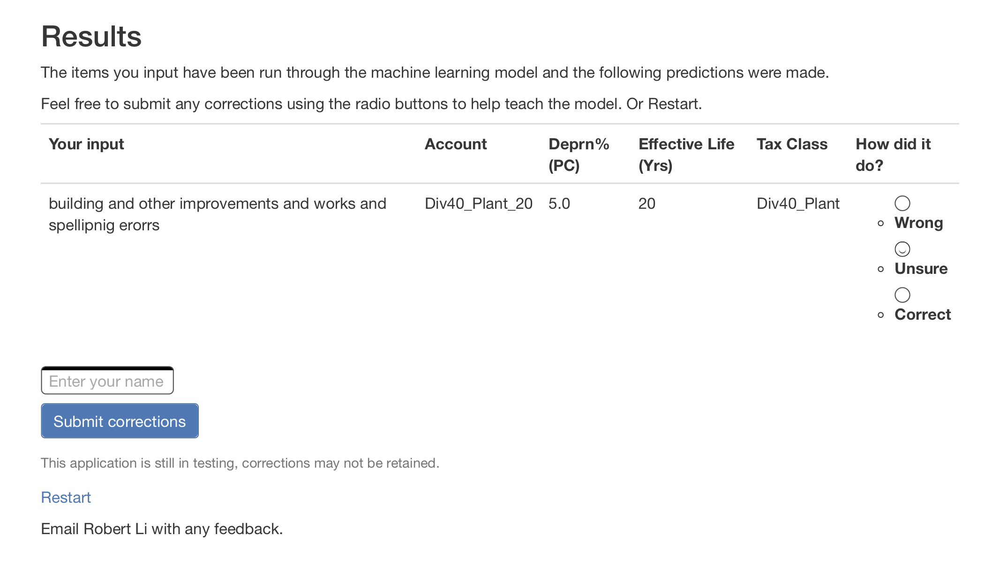

# Depreciation rate classifier in the Kebab Van

This Django app is a wrapper around [this project](https://github.com/itsrobli/depreciation-rate-classifier) for demo purposes.


# Live version

It's currently hosted on EC2 here:

http://ec2-13-239-135-95.ap-southeast-2.compute.amazonaws.com/


It looks like this:



Results look like this



You can submit things but there's no guarantee anything will be retained.


# Installation

I suggest using Nginx and Gunicorn. These are easier to configure than Apache and WSGI. YMMV.

Here is a guide for installing these on Ubuntu along with Postgres (SQLite works fine).

https://www.digitalocean.com/community/tutorials/how-to-set-up-django-with-postgres-nginx-and-gunicorn-on-ubuntu-18-04#creating-and-configuring-a-new-django-project

## Gotchas

1. Check `.gitignore` for things not included due to an abundance of caution.
2. Some Django things like URLs may not be best practice.
3. `requirements.txt` includes more libraries than absolutely necessary.
4. [NLTK](https://www.nltk.org) is a key component of pre-processing the text data.
    
    ```bash
    python -m nltk.downloader all;
    ```
